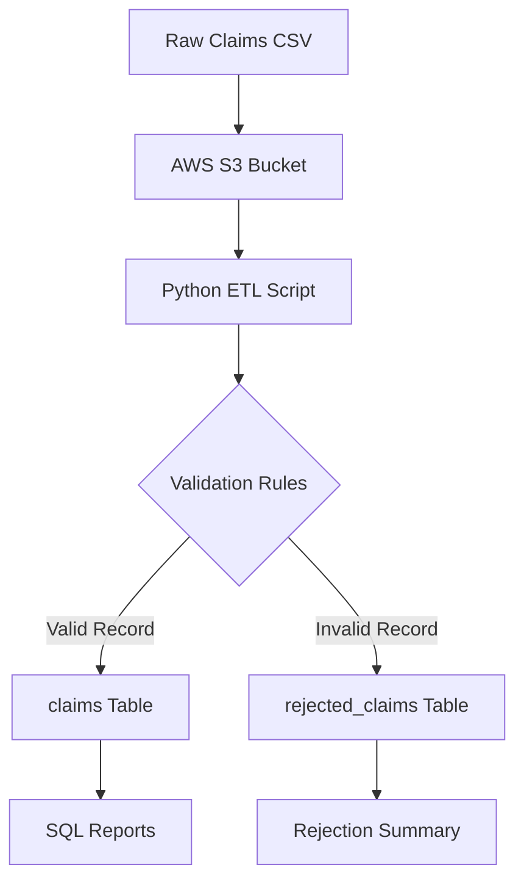

# Claims Data Quality Pipeline

## Overview

The **Claims Data Quality Pipeline** is a small ETL/data engineering project built with **Python, AWS S3, and PostgreSQL**.

The project simulates a common data developer workflow: raw insurance claims data is stored in AWS S3, ingested with Python, validated against business rules, and loaded into PostgreSQL for reporting. Valid records are inserted into a clean claims table, while invalid records are stored separately with rejection reasons for auditability and troubleshooting.

This project demonstrates:

* File ingestion from AWS S3
* Python-based ETL development
* Data validation and rejection handling
* PostgreSQL schema design
* SQL-based reporting
* Basic cloud and database workflow setup

---

## Pipeline Diagram



---

## What the Pipeline Does

* Reads raw insurance claims data from AWS S3
* Validates each claim using business rules
* Loads valid claims into PostgreSQL
* Stores rejected claims with rejection reasons
* Supports SQL reports for claim totals, provider summaries, and rejection analysis

---

## Tech Stack

* Python
* Pandas
* boto3
* PostgreSQL
* AWS S3
* Docker
* SQL

---

## Validation Rules

A claim is rejected if:

* `claim_id` is missing
* `claim_id` is duplicated
* `member_id` is missing
* `provider_id` is missing
* `claim_date` is invalid
* `claim_date` is in the future
* `claim_amount` is less than or equal to zero
* `status` is not `APPROVED`, `DENIED`, or `PENDING`

---

## Example Business Reports

The project includes SQL reports for:

* Total claims by status
* Total claim amount by provider
* Rejected claims by rejection reason
* Daily approved claim totals

---

## Prerequisites

Before running this project, make sure you have the following installed and configured:

### Required Tools

* **Python 3.10+**
* **Docker**
* **AWS Account**
* **AWS CLI**
* **PostgreSQL CLI**

  * The `psql` command should be installed and available in your system PATH.
* **Git Bash, PowerShell, or another terminal**

### AWS Requirements

You need an AWS account with access to S3.

You also need AWS CLI authentication configured locally:

```bash
aws configure
```

You will be prompted for:

```text
AWS Access Key ID
AWS Secret Access Key
Default region name
Default output format
```

To verify that AWS CLI authentication works:

```bash
aws sts get-caller-identity
```

---

## Project Structure

```text
claims-quality-pipeline/
│
├── data/
│   └── claims.csv
│
├── sql/
│   ├── schema.sql
│   └── reports.sql
│
├── src/
│   └── run.py
│
├── .env.example
├── .env
├── requirements.txt
└── README.md
```

---

## Initialization

### 1. Clone the Repository

```bash
git clone https://github.com/alex43002/claims-quality-pipeline.git
cd claims-quality-pipeline
```

---

### 2. Create a Python Virtual Environment

```bash
python -m venv venv
```

Activate the virtual environment.

For Git Bash:

```bash
source venv/Scripts/activate
```

For PowerShell:

```powershell
.\venv\Scripts\Activate.ps1
```

For macOS/Linux:

```bash
source venv/bin/activate
```

---

### 3. Install Python Dependencies

```bash
pip install -r requirements.txt
```

---

### 4. Create the Environment File

Create a `.env` file from the provided `.env.example` file.

```bash
cp .env.example .env
```

Then update the `.env` file with your local database and AWS S3 settings.

Example:

```env
AWS_BUCKET_NAME=your-bucket-name
AWS_OBJECT_KEY=claims.csv

POSTGRES_HOST=localhost
POSTGRES_PORT=5432
POSTGRES_DB=claims_db
POSTGRES_USER=postgres
POSTGRES_PASSWORD=postgres
```

---

### 5. Start PostgreSQL with Docker

```bash
docker run --name claims-postgres \
  -e POSTGRES_DB=claims_db \
  -e POSTGRES_USER=postgres \
  -e POSTGRES_PASSWORD=postgres \
  -p 5432:5432 \
  -d postgres:16
```

To confirm the container is running:

```bash
docker ps
```

---

### 6. Initialize the PostgreSQL Schema

Run the schema file to create the required tables:

```bash
psql -h localhost -U postgres -d claims_db -f sql/schema.sql
```

When prompted for a password, use:

```text
postgres
```

---

### 7. Create an S3 Bucket

Create an S3 bucket for the claims file:

```bash
aws s3 mb s3://your-bucket-name
```

Replace `your-bucket-name` with the same bucket name used in your `.env` file.

---

### 8. Upload the Claims CSV to S3

```bash
aws s3 cp data/claims.csv s3://your-bucket-name/claims.csv
```

Verify that the file was uploaded:

```bash
aws s3 ls s3://your-bucket-name/
```

---

### 9. Run the Pipeline

```bash
python ./src/run.py
```

The program will:

1. Read the claims file from AWS S3
2. Validate each claim
3. Insert valid claims into the `claims` table
4. Insert rejected claims into the `rejected_claims` table
5. Print a summary of loaded and rejected records

---

### 10. Run the SQL Reports

```bash
psql -h localhost -U postgres -d claims_db -f sql/reports.sql
```

---

## Database Tables

### `claims`

Stores valid claims that passed all validation rules.

### `rejected_claims`

Stores invalid claims along with the reason each record was rejected.

---

## Useful Commands

### Stop PostgreSQL Container

```bash
docker stop claims-postgres
```

### Start PostgreSQL Container Again

```bash
docker start claims-postgres
```

### Remove PostgreSQL Container

```bash
docker rm claims-postgres
```

### Connect to PostgreSQL Manually

```bash
psql -h localhost -U postgres -d claims_db
```

---

## Project Summary

This project is a compact example of a production-style data pipeline. It covers the core responsibilities of a data developer by combining ingestion, validation, database loading, rejection handling, and SQL reporting in one workflow.
